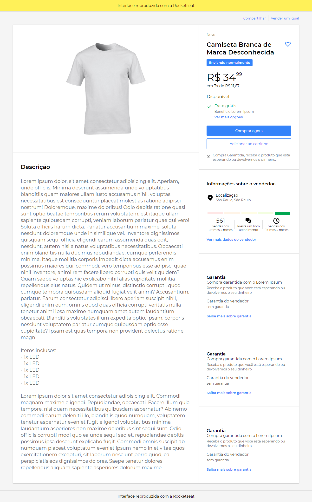

# UI Clone Mercado Livre

###### Interface reproduzida com a Rocketseat 🚀

## Clone da tela de produto do Mercado Livre

#reactjs #styledcomponents

## Passo a Passo para rodar esse App

_É importante que você possua o Node.js em sua máquina e também o npm para poder rodar esse App._

**1. Passo:**

`git clone https://https://github.com/Hudsonjr90/UicloneML.git`

**2. Passo:**

`npm i` ou `yarn`

**3. Passo:**

`npm start` ou `yarn start`
